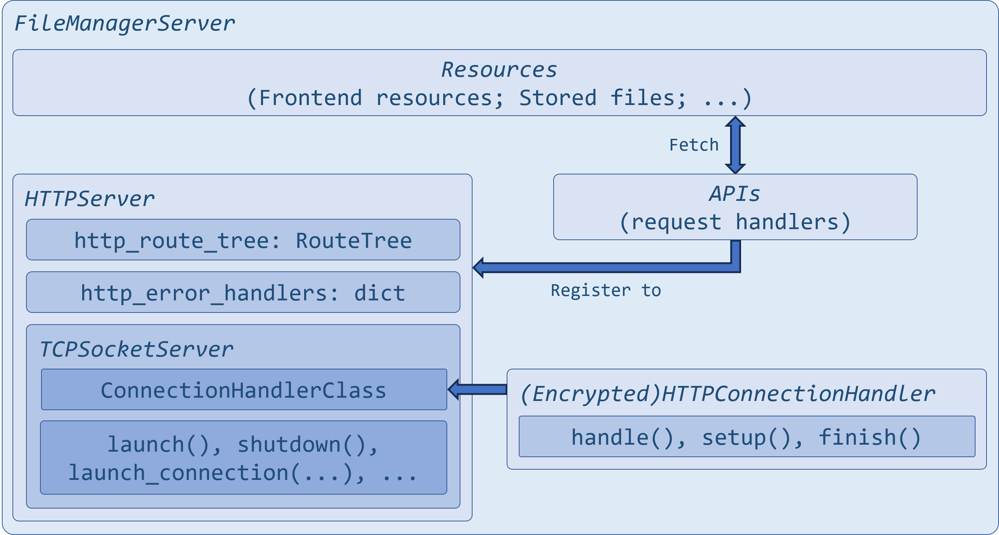
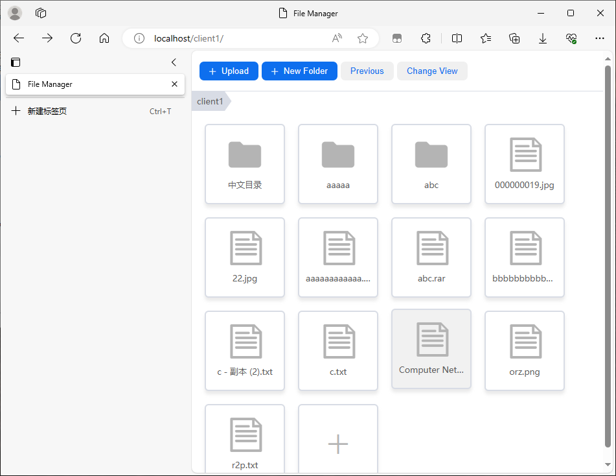

# http_file_manager

## Folders & Tips
`myhttp/`: A simple http server encapsulated in flask-like style.

`file_manager/`: A simple file manager application with front-end and back-end, based on `myhttp`.

`data/`: The data folder for `file_manager` (need to be created manually, so do user folders `data/client1`, `data/client2`, `data/client3`).

`reg/`: Account data and cookies for `file_manager`.

`doc/`: The document folder, containing the presentation slides.

## Startup
e.g. `python ./server.py -i localhost -p 80`

The module `pycryptodome` is required.

## Screenshots

